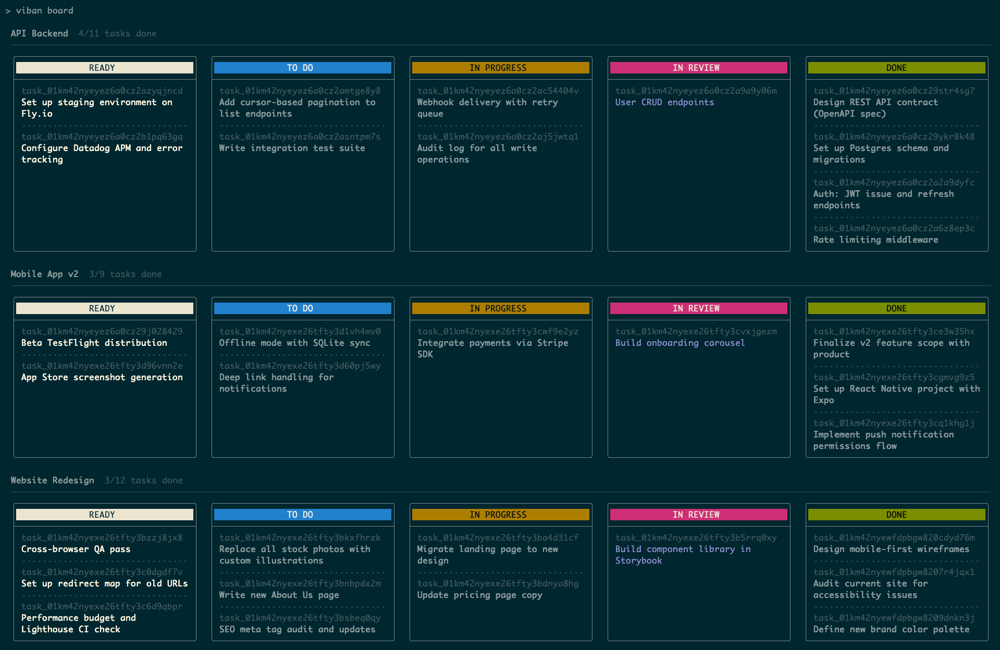
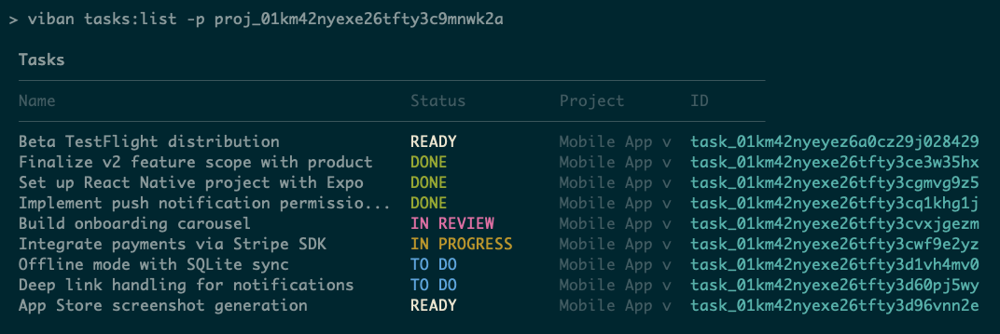
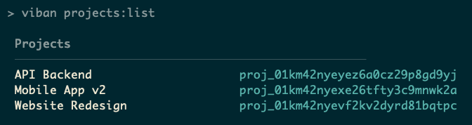

# viban

A Kanban-style board in your CLI, powered by local SQLite. See what your AI agents are doing, visually.



## Installation

```bash
npm install -g viban-cli
```

## Quick Start

```bash
# Initialize the database (creates a default project)
viban init

# View the Kanban board
viban board

# Add a task
viban tasks:new -n "My first task"

# Move a task to in-progress
viban tasks:move <task-id> in_progress
```

## Commands

### `viban init`

Initialize the local SQLite database and create the default project. Run this once before using other commands.

```bash
viban init
```

### `viban board`

Display one Kanban board per project, sorted by most recent activity. Archived tasks are not shown.

```bash
viban board
viban board -p myproject   # Show only a specific project's board
```

### Tasks



```bash
# List all tasks
viban tasks:list
viban tasks:list -p myproject    # Filter by project
viban tasks:list -s in_progress  # Filter by status
viban tasks:list -s archived     # Show only archived tasks

# Create a task
viban tasks:new -n "Fix login bug"
viban tasks:new -n "Add dark mode" -d "Support prefers-color-scheme" -p myproject -s todo

# Show task details
viban tasks:show <task-id>

# Update a task
viban tasks:update <task-id> -n "New name"
viban tasks:update <task-id> -s done
viban tasks:update <task-id> -p otherproject

# Move a task to a new status (shorthand)
viban tasks:move <task-id> <status>

# Archive done tasks (hidden from the board)
viban tasks:archive                    # Archive done tasks last updated > 14 days ago
viban tasks:archive -d 30              # Use a 30-day cutoff instead
viban tasks:archive -p myproject       # Scope to a specific project
viban tasks:archive -d 0               # Archive all done tasks immediately

# Delete a task
viban tasks:delete <task-id>
```

### Projects



```bash
# List all projects
viban projects:list

# Create a project
viban projects:new myproject

# Delete a project and all its tasks
viban projects:delete myproject
viban projects:delete myproject -f   # Skip confirmation prompt
```

## Flags Reference

| Command           | Flag                       | Description                                              |
| ----------------- | -------------------------- | -------------------------------------------------------- |
| `board`           | `-p, --project <project>`  | Show only a specific project's board                     |
| `tasks:list`      | `-p, --project <project>`  | Filter by project name or ID                             |
| `tasks:list`      | `-s, --status <status>`    | Filter by status (use `archived` to show archived tasks) |
| `tasks:new`       | `-n, --name <name>`        | Task name/title                                          |
| `tasks:new`       | `-d, --description <desc>` | Task description                                         |
| `tasks:new`       | `-p, --project <project>`  | Project name or ID (default: "default")                  |
| `tasks:new`       | `-s, --status <status>`    | Initial status (default: ready)                          |
| `tasks:update`    | `-n, --name <name>`        | New name                                                 |
| `tasks:update`    | `-d, --description <desc>` | New description                                          |
| `tasks:update`    | `-s, --status <status>`    | New status                                               |
| `tasks:update`    | `-p, --project <project>`  | Move to a different project                              |
| `tasks:archive`   | `-p, --project <project>`  | Scope archiving to a specific project                    |
| `tasks:archive`   | `-d, --days <days>`        | Cutoff in days (default: 14)                             |
| `projects:delete` | `-f, --force`              | Skip confirmation prompt                                 |

## Task Statuses

Tasks move through the following workflow statuses. The `archived` status is set automatically by `tasks:archive` and hides tasks from the board.

| Status        | Aliases                            | Notes                                           |
| ------------- | ---------------------------------- | ----------------------------------------------- |
| `ready`       |                                    |                                                 |
| `todo`        |                                    |                                                 |
| `in_progress` | `wip`, `inprogress`, `in progress` |                                                 |
| `in_review`   | `review`, `inreview`, `in review`  |                                                 |
| `done`        |                                    |                                                 |
| `archived`    |                                    | Set via `tasks:archive` only; hidden from board |

## AI Agent Integration

viban ships with a `SKILL.md` file that instructs AI agents (Claude, Cursor, Copilot, etc.) to track their work on the Kanban board in real time as they complete tasks — so you can see exactly what your agents are doing without having to ask.

### Installing SKILL.md

Copy `SKILL.md` into any project where you want agents to track their work. Agents pick it up automatically when it is present in the project root.

```bash
# From the viban-cli repo
cp SKILL.md /path/to/your/project/SKILL.md
```

Or download it directly into your project:

```bash
curl -o SKILL.md https://raw.githubusercontent.com/vlucas/viban-cli/main/SKILL.md
```

### How It Works

Once `SKILL.md` is in your project, an AI agent working in that directory will:

1. Create a viban task when it starts a unit of work
2. Move it to `in_progress` when it begins
3. Move it to `in_review` when it needs your attention
4. Mark it `done` when complete

Run `viban board` at any time to see a live view of what your agents are doing.

## Data Storage

viban stores all data in a local SQLite database at `~/.viban/db.sqlite`. You can override this with the `VIBAN_DB` environment variable.

## License

BSD-3-Clause
